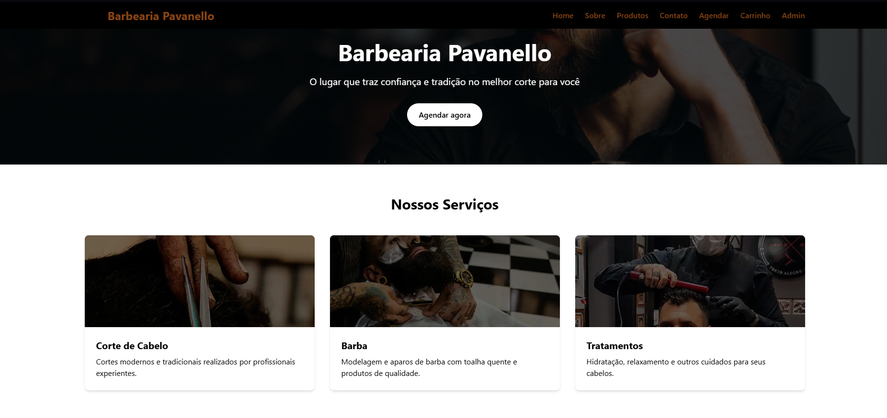

# 💈 Barbearia Pavanello

<p align="center">
  
</p>

<p align="center">
  
  
  
  
</p>

## 📋 Sobre o Projeto

Sistema web completo para gerenciamento de barbearia, permitindo o agendamento de serviços, venda de produtos e administração completa do negócio.

### ✨ Funcionalidades

#### 🧑‍💼 Área do Cliente

- **Agendamento online** de serviços de barbearia
- **Compra de produtos** com carrinho de compras
- **Visualização de serviços** disponíveis
- **Formulário de contato** para dúvidas e informações

#### 👨‍💻 Área Administrativa

- **Dashboard** com resumo dos principais indicadores
- **Gerenciamento de agendamentos** (aprovar, rejeitar, concluir)
- **Controle de estoque** de produtos
- **Gestão financeira** e controle de caixa
- **Relatórios** de vendas e serviços
- **Cadastro de fornecedores**

## 🚀 Tecnologias

- **Next.js 15**: Framework React com renderização híbrida
- **React 19**: Biblioteca para construção de interfaces
- **TypeScript**: Superset JavaScript tipado
- **Tailwind CSS 4**: Framework CSS utilitário
- **React Icons**: Biblioteca de ícones para React
- **Cookies Next**: Gerenciamento de cookies

## 🛠️ Como executar

1. Clone o repositório:

   ```bash
   git clone https://github.com/seu-usuario/barbearia-pavanello.git
   cd barbearia-pavanello
   ```

2. Instale as dependências:

   ```bash
   npm install
   ```

3. Execute em desenvolvimento:

   ```bash
   npm run dev
   ```

4. Para build de produção:
   ```bash
   npm run build
   npm start
   ```

## 📂 Estrutura do Projeto

```
barbearia-next/
├── public/           # Arquivos estáticos
│   ├── images/       # Imagens do site
│   └── produtos/     # Imagens de produtos
├── src/
│   ├── app/          # Rotas e páginas (App Router)
│   │   ├── admin/    # Painel administrativo
│   │   ├── api/      # Rotas de API
│   │   └── ...       # Demais páginas
│   ├── components/   # Componentes reutilizáveis
│   └── utils/        # Funções utilitárias
└── ...
```

## 💡 Melhorias Implementadas

- **Design Responsivo**: Interface adaptável para dispositivos móveis, tablets e desktops
- **Autenticação de Usuários**: Sistema de login para acessar área administrativa
- **Armazenamento Local**: Persistência de dados para ambiente de desenvolvimento
- **UI/UX Aprimorada**: Interface moderna e de fácil navegação
- **Gerenciamento de Estado**: Sistema eficiente de controle de estado dos componentes

## 👨‍💻 Autor

Desenvolvido por Saulo Pavanello

[](https://www.linkedin.com/in/saulopavanello/)

---

<p align="center">
  <i>Este projeto foi desenvolvido com 🖤 e ☕</i>
</p>
